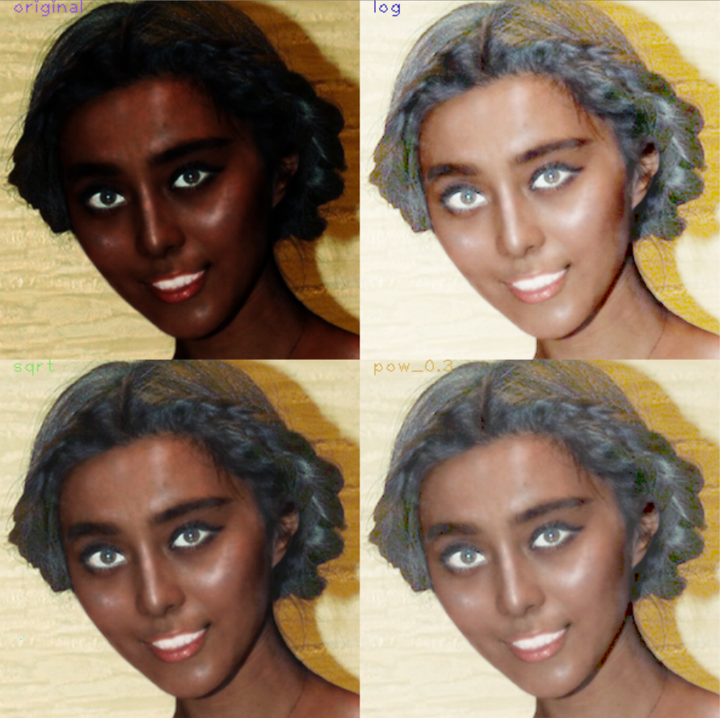
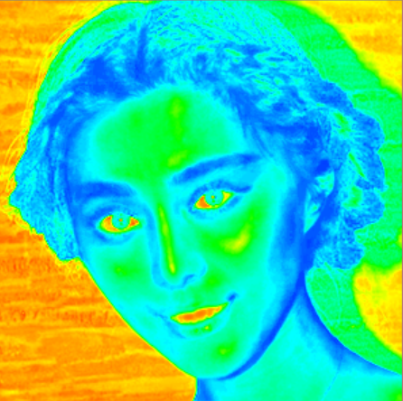

# 使用说明

###检测直线`linedetect.cpp`
####程序说明
本程序读取一个图片，并检测图片中相对粗且黑色的直线
####程序流程
输入一副图片，调整至适当大小，进行均值模糊（比高斯模糊要好） 
采用大小为301的核进行自适应阈值，获得二值图像，随后利用形态学的开算法去除一些小的杂点，利用canny算子检测边缘，在用概率霍夫变换检测直线
####入口
- 直接双击程序，对文件夹下`template.png`进行检测
- sztx.exe [img --default template.png]
####出口结果

###jpeg压缩`jpeg.cpp`
####程序说明：
读取一个bmp，转换成一个jpg，利用里libjpeg库
####入口
- 直接双击程序，对文件夹下`template.bmp`进行图片压缩
- sztx.exe [option][img --default template.bmp]

随后要求输入一个有关图形质量的参数，在0-100之间 
其中`option`	选项

	-opencv or -o:以Mat的方式读取数据，并对JSAMPLE类型赋值
	-e :示例程序，默认以Mat方式读取图像，图形质量为60
	-f or -*:其他option均使用File的方式读取一个bmp
####出口
最终会显示，压缩前后，文件大小对比：

####出现的问题
当使用FILE以及`BITMAPINFO`进行读取bmp文件时，不仅bgr顺序需要
更改为rgb顺序，上下翻转，更奇怪的是，bgr好像是错位的，尽管每行都是3的整数倍，但是只有当把每行第一位跳过的时候，显示的颜色才是正确的，否则红色会变成绿色，绿色会变成蓝色

###查找表`lut.cpp`
####入口
- 直接双击程序，对文件夹下`black.png`进行处理
- CMD中运行格式为
    > sztx.exe [option][img --default template.jpg]

其中 `option`:
"-log","-sqrt","-pow"(默认为0.3的指数）,"-example or -e"(缺省值)
####出口
在`example`状态下，包含了其他三种情况,对数，平方根，指数；并且生成伪彩色图像
 
####

###滤波`smooth.cpp`
共有三种滤波方式，算术、几何、谐波均值滤波  
####入口
- 直接双击程序，对文件夹下`template.jpg`进行处理//在经椒盐噪声后，一次用三种方法滤波
- 在cmd中运行，格式为

    > sztx.exe [img --default template.jpg] [option]  
  
  其中`option`选项含义如下:

    -a : 或-arithmetric 算术平均值滤波
    -g : 或-geometry 几何均值滤波
    -h : 或-harmonic 谐波均值滤波
    -e : 或-example 示例程序，三种滤波效果对比

####出口
- 算术平均滤波，由于运算速度较快，选择按任意键开始每隔对滤波kernal放大进行再次滤波，按空格键暂停，`esc`	退出
- 几何均值滤波和谐波均值滤波，均有一个关于kernal的track bar用于调整
- 示例程序的输出结果： 
在原图片分别被，椒盐，盐，椒噪声干扰后进行滤波后的结果

###小波变换`dwt.cpp`
####入口：
- 直接双击对文件下的`template.jpg`进行一次小波变换
- 在cmd中运行，格式为
	>sztx.exe [img --default template.jpg] [times] 
	//即对某图片进行多次小波变换

####出口
对样本图片进行两次小波变换结果：

###低通滤波器	`lpf.cpp`
####入口:
- 直接双击会显示`help`函数，声明该程序如何使用
- 在cmd中运行，其格式为
	>sztx.exe [option][img --default template,jpg]

######option共有如下选项：

	--e : 或--example，示例程序，当没有图片参数时，默认调用template.jpg
 	--i : 或--ideal low pass filter 理想低通滤波器
 	--g : 或--gaussian LPF 高斯低通滤波器
 	--b : 或--butterworth LPF 巴特沃斯低通滤波器
#####理想低通滤波器
程序要求输入一个参数，其值建议 < `min(src.rows,src.cols)/2`
#####高斯低通滤波器
程序要求输入两个参数，分别为横向与纵向的高斯sigma参数，此参数越小
模糊效果月明显
#####巴特沃斯低通滤波器
程序要求输入两个参数，分别为与截止频率有关的半径，以及阶数
#####示例程序
示例程序默认对`template.jpg`进行处理, 也可在结尾输入想要处理的图片位置
 处理结果放置到一副图片中，分别为

|b分量|被理想滤波后的频域下图片|被理想低通滤波器滤波后的图像|
|:--|:--|:--|
|g分量|被高斯低通滤波后频域下图片|高斯滤波后的空间域图像|
|r分量|被巴特沃斯滤波后的频域下图片|巴特沃斯滤波后的空间域图像|
####出口：
####示例程序结果范例：

 
 

###简单图像处理，二值化，直方图等功能	`sztx.cpp`
####入口：

- 直接双击，默认调用文件夹下的`template.jpg	`作为源图像
- 在cmd中运行，添加一个图片作为源图像如 

	> sztx.exe template2.jpg  
	> sztx.exe d:\tmp\2.jpg
	
####出口:

- 将源图片保存为bmp格式，输出为`dst.bmp	`
- 生成一副图片包含9个部分，依次为：

|R分量|源图片|二值图片|
|:--|:--|:--|
|G分量|灰度图|直方图均衡化后图片|
|B分量|灰度图直方图|直方图均衡化后直方图|

####结果范例：

