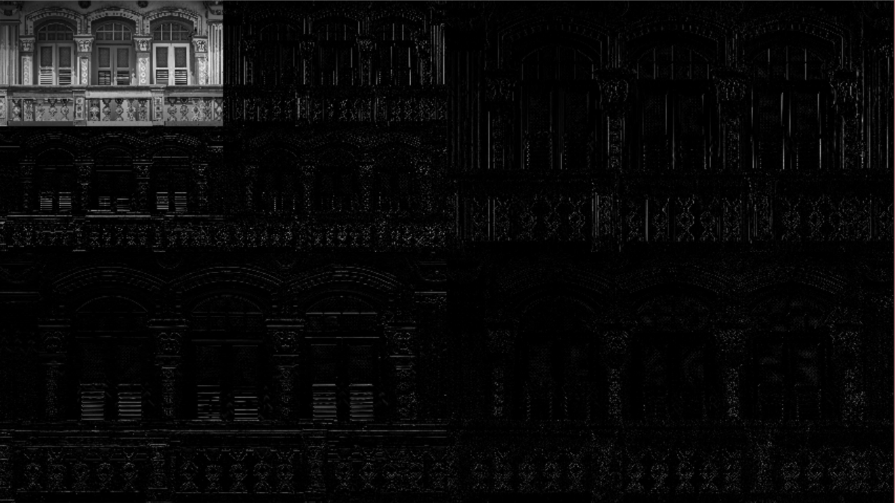

# 使用说明

###程序说明
###小波变换`dwt.cpp`
####入口：
- 直接双击对文件下的`template.jpg`进行一次小波变换
- 在cmd中运行，格式为
	>sztx.exe [img --default template.jpg] [times] 
	//即对某图片进行多次小波变换
####出口
对样本图片进行两次小波变换结果：

###低通滤波器	`lpf.cpp`
####入口:
- 直接双击会显示`help`函数，声明该程序如何使用
- 在cmd中运行，其格式为
	>sztx.exe [option][img --default template,jpg]

######option共有如下选项：

	--e : 或--example，示例程序，当没有图片参数时，默认调用template.jpg
 	--i : 或--ideal low pass filter 理想低通滤波器
 	--g : 或--gaussian LPF 高斯低通滤波器
 	--b : 或--butterworth LPF 巴特沃斯低通滤波器
#####理想低通滤波器
程序要求输入一个参数，其值建议 < `min(src.rows,src.cols)/2`
#####高斯低通滤波器
程序要求输入两个参数，分别为横向与纵向的高斯sigma参数，此参数越小
模糊效果月明显
#####巴特沃斯低通滤波器
程序要求输入两个参数，分别为与截止频率有关的半径，以及阶数
#####示例程序
示例程序默认对`template.jpg`进行处理, 也可在结尾输入想要处理的图片位置
 处理结果放置到一副图片中，分别为

|b分量|被理想滤波后的频域下图片|被理想低通滤波器滤波后的图像|
|:--|:--|:--|
|g分量|被高斯低通滤波后频域下图片|高斯滤波后的空间域图像|
|r分量|被巴特沃斯滤波后的频域下图片|巴特沃斯滤波后的空间域图像|
####出口：
####示例程序结果范例：

 
 

###简单图像处理，二值化，直方图等功能	`sztx.cpp`
####入口：

- 直接双击，默认调用文件夹下的`template.jpg	`作为源图像
- 在cmd中运行，添加一个图片作为源图像如 

	> sztx.exe template2.jpg  
	> sztx.exe d:\tmp\2.jpg
	
####出口:

- 将源图片保存为bmp格式，输出为`dst.bmp	`
- 生成一副图片包含9个部分，依次为：

|R分量|源图片|二值图片|
|:--|:--|:--|
|G分量|灰度图|直方图均衡化后图片|
|B分量|灰度图直方图|直方图均衡化后直方图|

####结果范例：

